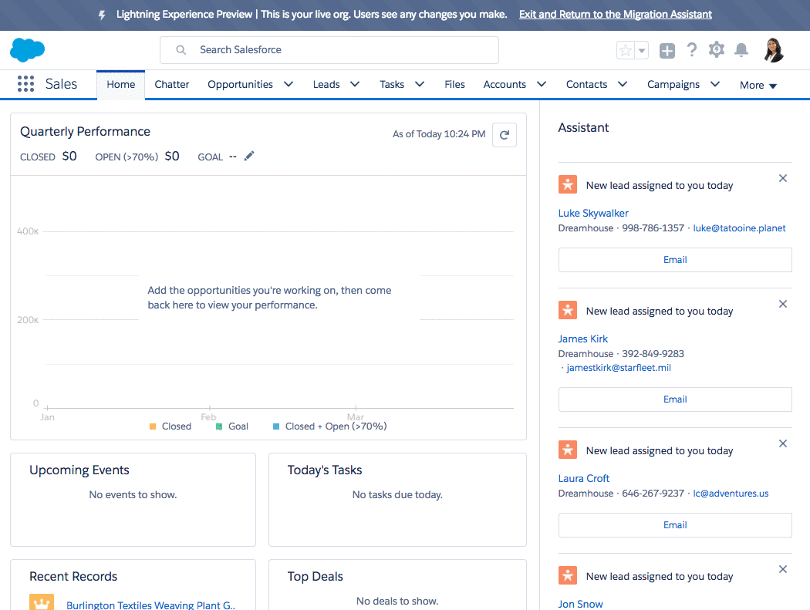

Before we roll out Lightning Experience for our end users and start building apps, let's take some time to get familiar with the Lightning Experience interface and define user access. In the Lightning Experience Migration Assistant, which is available in Setup, you can find tools to help you with this: learning trails, feature comparison charts, ways to preview your customizations in Lightning Experience, how to enable key Lightning Experience features like Notes and News, and finally, how to enable Lightning Experience itself. 

In this exercise we will be reviewing the Migration Assistant in our workshop environment, but you can use all of these tools in your production Salesforce org to learn more about what your features and customizations will look like in Lightning Experience. The most important parts of the Migration Assistant are the Preview tool and the Readiness Check. The Preview tool allows you to see your apps in Lightning Experience before you actually enable it. 

The Readiness Check provides you with a Readiness Report, which includes an itemized list of the features you use and customizations you've created, along with explanations about how they will be supported in Lightning Experience or what may need additional review.

### Evaluate Lightning Experience

1. Learn about Lightning Experience, define Lightning Experience access for users, and enable Lightning Experience for your org 
    1. Preview what your org will look like in Lightning Experience
        1. Setup > Lightning Experience > Preview Your Org In Lightning Experience > **Preview** 
        2. Click around your environment in Lightning Experience. Use this preview to see what your Salesforce apps will look like in Lightning Experience.     
            1.  Click on the **Opportunities tab**
            2. Select the **All Opportunities** list view, then click into the **Burlington Textiles Opportunity Record**
            3. Click around the opportunity page a bit to explore the look and feel of Lightning Experience, use the Path to change the Opportunity Stage to Value Proposition 
        3. **Exit and Return to the Migration Assistant**
    2. **Run the Lightning Experience Readiness Check and Review your Readiness Report.** The Lightning Experience Readiness Report helps Admins learn more about what they need to consider as they turn on Lightning Experience. Additionally, based upon what functionality your org currently uses, the Readiness Report will contain recommendations on what you should do next. Keep in mind that your Lightning Experience Readiness Report won’t identify all of the unsupported features and customizations in Lightning Experience, but it will help give you a sense of how ready your unique org is for Lightning Experience.
        1. Setup > Lightning Experience > Check Your Lightning Experience Readiness > **Evaluate** > Allow > Got It 
        2. Go to your email inbox and take a look at your report. It may take a few minutes, and if you don't see it try searching “readiness” in case it got routed to an email folder. Review your report and notice the way different features are highlighted. 

### Grant Lightning Experience Access to Users

Now that we've explored the Lightning Experience look and feel, let's go ahead and grant access to specific users with a custom **permission set** and enable Lighting Experience for our environment. Lightning Experience is enabled for users in **_two parts_**. The first part of Lightning Experience access is through the **Lightning Experience user permission checkbox** on the user level through either a **profile** or **permission set**. All standard profiles have this permission enabled by default. The second part is that your Salesforce environment is enabled for Lightning Experience via the **Setup > Lightning Experience > Enable Lightning Experience** button. 

1. Create Lightning Experience permission set to grant Lightning Experience access to end users. 
    1. Setup > Manage Users > Permission Sets > **New**
        1. Label: Lightning Experience User
        2. API Name: Lightning_Experience_User
        3. License: —None--
        4. **Save**
2. On the permission set page for Lightning Experience user, edit to add the Lightning Experience permission set
    1. You should already be on the Lightning Experience user permission set page. If not, select the Lightning Experience permission set from the permission sets page. System Section > Click **System Permissions**
    2. **Edit**
    3. Check box for: **Lightning Experience User**
    4. **Save**
3. Now that you have created a Permission set, this is a good time to review who will have access to Lightning Experience when you enable it!
    1. Setup > Manage Users > Users > **Randy Realtor**
        1. Your end user, Randy Realtor has the Dreamhouse User custom profile assigned. Take a look at the profile and check if it has Lightning Experience enabled. 
        2. User detail page > Profile > **Dreamhouse User**
        3. Scroll down the profile detail page to the administrative permissions section and notice that Lightning Experience is not checked. This means that when you enable Lightning Experience for your org, **Randy will only see Lightning Experience if he is assigned a profile or permission set with the Lightning Experience permission enabled.**
        4. Since Randy does not have access to Lightning Experience with his custom profile, we can assign him the Lightning Experience permission set. This allows us to grant Randy access to Lightning Experience in a controlled rollout without modifying his custom profile. This is layering the ability for Randy to use Lightning Experience on top of all his existing access granted in his profile.
            1. User > Randy Realtor > Permission Set Assignments > Edit Assignment > Move **Lightning Experience User** to the Enabled Permission Sets column > Save 

### Enable Lightning Experience for your Salesforce Environment

1. Now that you have reviewed and granted Lightning Experience Access, it is time to enable Lightning Experience and some Lightning Experience-related features.  
   1. Setup > Lightning Experience > Notes > Click the **Disabled** button to Enable Notes
   2. Setup > Lightning Experience > News > Click the **Disabled** button to Enable this feature. 
   3. Setup > Lightning Experience > Lightning Experience > Click the **Disabled** button > Finish Enabling Lightning Experience 

Your Org is now Lightning Experience Enabled!

    

        <a href="Exercise_d1.html" class="btn btn-default"><i class="glyphicon glyphicon-chevron-left"></i> Previous</a>
        <a href="Exercise_d3.html" class="btn btn-default pull-right">Next <i class="glyphicon glyphicon-chevron-right"></i></a>
    

