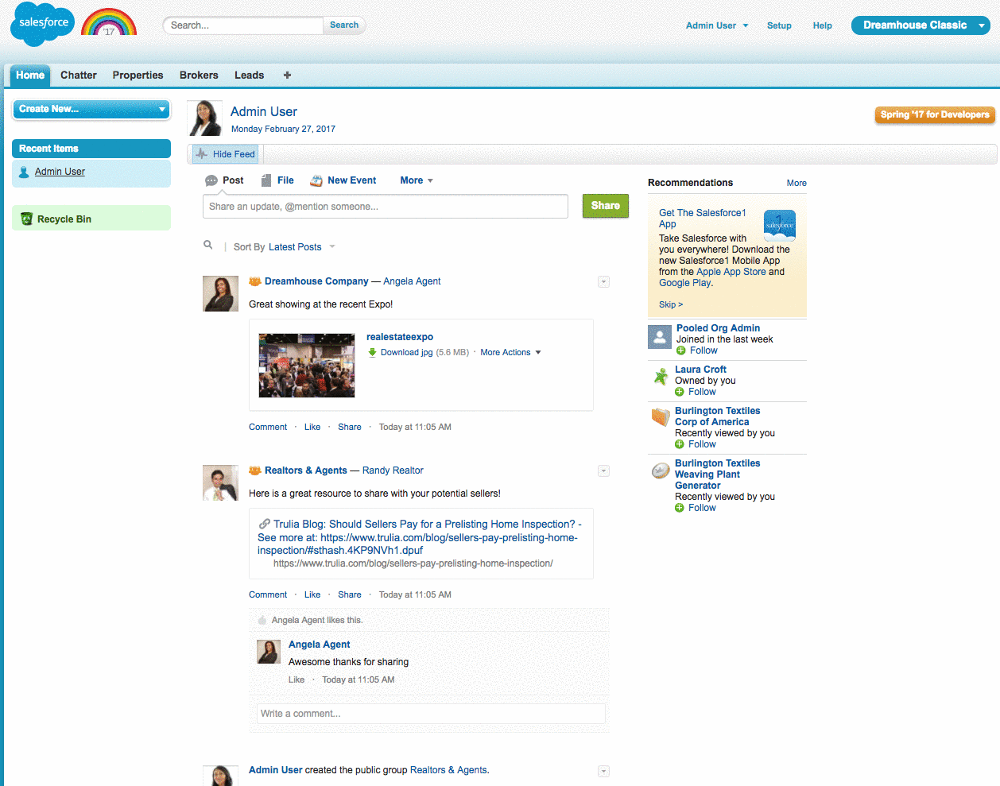
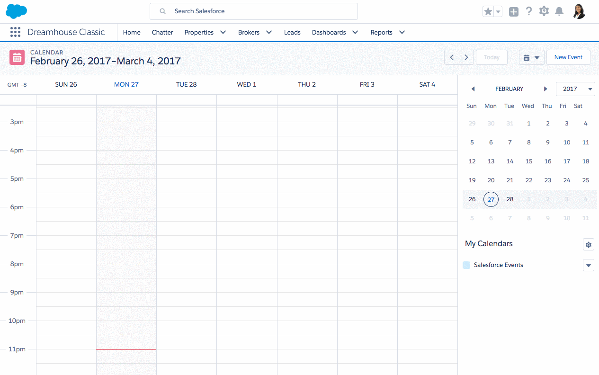

### Make Classic Dreamhouse App Available In Lightning

Lightning is now enabled in your environment!  Time to make your custom app, Dreamhouse Classic, available to your Lightning users.  If you are just getting started with Lightning and want to explore what your Classic app will look like, we can do this with just a few clicks. However, while this is a fast and easy way to make your Classic app visible in Lightning, it will still have some limitations. Later on we'll finish our Lightning migration by creating a brand new Lightning app for Dreamhouse. 

1. First, switch to Lightning Experience for yourself so you can start exploring and building. When you enable Lightning for yourself and your users, all users will still have the option to switch back and forth between Lightning and Classic experience from this drop down.  
    1. Your profile drop down at top right of page > **Switch to Lightning Experience**
2. Make your classic app visible in Lightning and add some additional tabs. This does not impact the app experience for our Classic users, but it makes the current Classic app visible to Lightning users in the App Launcher. Notice that there is also an option to “Upgrade” your custom app when you are in the App Manager. The upgrade option creates a new Lightning app clone of your Classic app. 
    1. All Setup (gear icon) > Apps > App Manager > **Dreamhouse Classic** > Edit > Select the “Show in Lightning Experience” Checkbox.
    2. In the Choose the Tabs box, select the **Chatter, Dashboard** & **Reports** tabs and move to the Selected Tabs box. 
    3. Save

### Explore Lightning End User Features 

Now with just a few clicks you've made your Classic app visible in Lightning. Let's take a look at what this app looks like in Lightning and explore some of the end user features immediately available in Lighting Experience. These are features that your end users can take advantage of right away with basic user training. 

#### Lightning App Launcher

All of your Lightning apps, including your Classic apps that are marked as **Visible in Lightning Experience** can be found in the App Launcher. The App Launcher is also where your users can access all the tabs they have access to, whether or not they are included in a Lightning app. Navigate to your Classic app in Lightning using the App Launcher. [screenshot](images/ex3.2.gif)

1. App Launcher > Review the apps that are available, notice that the tabs are available just below the App icons. 
2. App Launcher > Click into the **Dreamhouse Classic** App block 

#### Chatter

Now that we are in the Lightning view for the Dreamhouse Classic App, lets get oriented to the new experience and navigation, starting with Chatter. (images/ex3.4.gif)

1. Chatter Tab
2. Click on **Company Highlights.** Company Highlights will show trending, new and popular posts from across your organization even if you are not following the related records. 
3. **Chatter Streams.** Chatter Streams is where your users can create curated lists of records and people to follow. Create up to five Chatter streams that combine posts from different feeds and different feed types. Combine feeds from people, groups, and records, like your accounts, opportunities, and cases. 
        1. Chatter Streams 
            1. Name: Top Properties & Brokers
            2. Include in Stream
                1. Properties: 121 Harborwalk Drive & 127 Endicott St
                2. Users: Angela Agent, Randy Realtor
                3. Save. You now have a brand new, curated Chatter Stream that allows you to quickly get to the relevant updates for a specific set of records, even if you are not following those records. 

#### Search 

Lightning has expanded Search functionality. When you know which object you want to search, start typing the name of the object in the search box. You have the option to limit your search to that object. This feature works only for your most frequently used objects, objects in the navigation bar, and Chatter. You can search one object at a time. Let's explore Lightning Search (images/ex3.5.gif)

1. Click Search Bar. In Lightning your recent items will now be accessible in a drop down from your global search bar. 
2. Type “Accounts”.  You will see now see the option to Search the string “Accounts”, search within the tab you are currently on(Chatter), or to define your search to the Account object. 
3. Select Limit **Search to Account**. This limits your search to within the Account object. Now type “Edge” and hit enter. 
4. Click on Top Results to see results from multiple objects. 
5. Click on the Account record **Edge Communications**

#### Favorites

If you’re familiar with customizing tab sets in Salesforce Classic, you’ll like the way you can personalize your  navigation with favorites. Favorites let you quickly access important records, lists, groups, dashboards, and other frequently used pages in Salesforce. They’re similar to bookmarks in a web browser but better because your favorites are available no matter which browser or computer you use to log into Lightning Experience.

1. While viewing the Account record for Edge Communications **Select the star in the upper right of your Lightning view** to add the current record to your favorites list.
2. You can manage Favorites right from the Favorites menu. Select the Favorites star drop-down menu to view your favorites, and click **Edit Favorites** to rename, reorder, or remove Favorited items. 
3. Select **Done**.

#### Navigation, List View Charts, & kanban 

The Navigation bar and List Views in Lightning have new features to explore as well

1. Select the drop-down next to the Properties tab. In the drop-down you can create new records, view favorites for this object, or select a list view.
2. Click on **Top Listings** list view.
3. Edit some property records from your list view, you can also try editing list view records without your mouse using your Arrow Keys + Enter.
4. In Lightning, your users also have new ways to access records and visualize the records in a list view. Let's take a look. 
    1. Chart Icon > gear icon below existing chart > New Chart > Create a new chart for your list view
        1. Name: Average Assessment by Status
        2.  Chart Type: Vertical Bar Chart
        3. Aggregate Type: Average
        4. Aggregate Field: Assessed Value
        5. Group Field: Status
        6. Save

Now that we have added a new chart visualization for our list view, lets look at a new way for users to view and interact with the records with the **Kanban View**. The Kanban view displays a visual summary for a selection of records. By seeing all your records at once, users can more effectively monitor their work and keep business processes moving forward. Switch to the Kanban view for almost any object from the object’s list view. The Kanban view isn’t available on a few objects, such as knowledge and tasks and is also not available on the **Recently Viewed** list view for an object. 

1. Select the icon 
1. Display As: **KanBan View**
    1. Play with the Kanban by dragging & dropping records to a different status. 

#### Calendar

In Lightning anyone can create a calendar from a standard or custom object by choosing a date field representing data they want to track. The calendar displays data in that field as calendar items. Users can customize most calendars by applying a list view, and they can edit and delete calendars they’ve created.

1. App Launcher > Calendar Tab (This can be found in the **All Items** area below the Lightning apps in your App Launcher or by searching in the App Launcher search window)
2. Select the Gear Icon next to “My Calendars” for **New Calendar**. 
    1. Object: Property 
    2. Next 
    3. Calendar Name: Top Listings 
    4. Field for Start: Date Listed
    5. Field for end: None
    6. Apply a Filter: Top Listings
    7. Field Name to Display: Property Name
    8. Save
3. Select Options arrow for your new **Top Listings** calendar and select a new custom color from the palette 
4. In the top right of your calendar tab, change the calendar date range view from Week to **Month**
5. Favorite this tab

    

        <a href="Exercise_d2.html" class="btn btn-default"><i class="glyphicon glyphicon-chevron-left"></i> Previous</a>
        <a href="Exercise_d4.html" class="btn btn-default pull-right">Next <i class="glyphicon glyphicon-chevron-right"></i></a>
    

